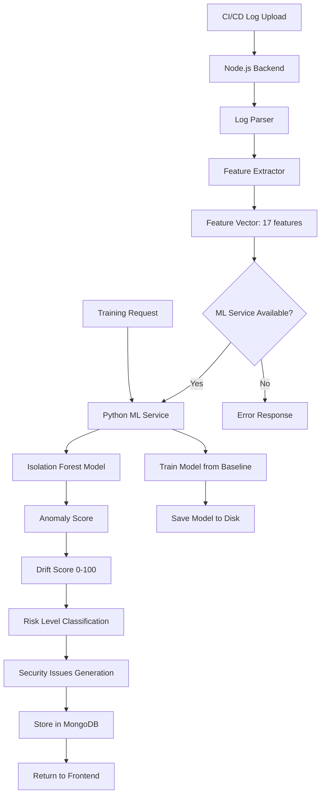

# Python ML Model Integration Plan

## Architecture Overview

The system will use a microservices architecture where a Python ML service handles all machine learning operations, and the Node.js backend communicates with it via REST API.

### System Flow



### Component Architecture

```
┌─────────────────────────────────┐
│   Node.js Backend (Port 3001)    │
│  ┌───────────────────────────┐  │
│  │  Feature Extraction        │  │
│  │  (17 numeric features)    │  │
│  └───────────┬───────────────┘  │
│              │ HTTP REST API      │
│              ▼                    │
└───────────────────────────────────┘
              │
              │ POST /predict
              │ POST /train
              │ GET /health
              ▼
┌─────────────────────────────────┐
│  Python ML Service (Port 5000) │
│  ┌───────────────────────────┐ │
│  │  FastAPI/Flask Server     │ │
│  │  ┌─────────────────────┐  │ │
│  │  │ Isolation Forest    │  │ │
│  │  │ Model (scikit-learn) │  │ │
│  │  └─────────────────────┘  │ │
│  │  ┌─────────────────────┐  │ │
│  │  │ Model Persistence   │  │ │
│  │  │ (joblib/pickle)     │  │ │
│  │  └─────────────────────┘  │ │
│  └───────────────────────────┘ │
└─────────────────────────────────┘
```

## Implementation Plan

### Phase 1: Python ML Service Setup

**Directory Structure:**

```
ml-service/
├── app/
│   ├── __init__.py
│   ├── main.py              # FastAPI application
│   ├── models/
│   │   ├── __init__.py
│   │   ├── isolation_forest.py  # ML model wrapper
│   │   └── model_manager.py    # Model loading/saving
│   ├── schemas/
│   │   ├── __init__.py
│   │   └── requests.py      # Pydantic request models
│   └── utils/
│       ├── __init__.py
│       └── feature_validator.py
├── models/
│   └── baseline_model.pkl   # Trained model storage
├── requirements.txt
├── Dockerfile
└── README.md
```

**Key Files:**

1. **`ml-service/app/main.py`** - FastAPI application

   - Endpoints:
     - `POST /predict` - Predict drift score from feature vector
     - `POST /train` - Train model from baseline feature vectors
     - `GET /health` - Health check
     - `GET /model/info` - Get model metadata

2. **`ml-service/app/models/isolation_forest.py`** - ML model implementation

   - Isolation Forest from scikit-learn
   - Anomaly score to drift score conversion (0-100)
   - Risk level classification

3. **`ml-service/app/models/model_manager.py`** - Model persistence

   - Save/load models using joblib
   - Model versioning
   - Model metadata tracking

**Dependencies (`requirements.txt`):**

```
fastapi==0.104.1
uvicorn[standard]==0.24.0
scikit-learn==1.3.2
numpy==1.24.3
pydantic==2.5.0
joblib==1.3.2
python-multipart==0.0.6
```

### Phase 2: ML Model Implementation

**Isolation Forest Configuration:**

- Algorithm: `sklearn.ensemble.IsolationForest`
- Parameters:
  - `n_estimators=100` (number of trees)
  - `contamination=0.1` (expected anomaly rate - 10%)
  - `random_state=42` (for reproducibility)
  - `max_samples='auto'` (auto-detect sample size)

**Anomaly Score to Drift Score Conversion:**

```python
# Isolation Forest returns:
# -1 = anomaly (outlier)
# 1 = normal (inlier)
# decision_function() returns continuous score

# Conversion logic:
# 1. Get anomaly score from decision_function()
# 2. Normalize to 0-1 range (lower = more anomalous)
# 3. Scale to 0-100 (drift score)
# 4. Higher drift score = more anomalous
```

**Risk Level Classification:**

- Same thresholds as current system:
  - Low: 0-30
  - Medium: 31-50
  - High: 51-70
  - Critical: 71-100

### Phase 3: Node.js Backend Integration

**Modify `backend/src/detector/driftDetector.js`:**

Replace the statistical detection method with ML service calls:

```javascript
// New function to call Python ML service
async function detectDriftWithML(featureVector, options = {}) {
  const mlServiceUrl = process.env.ML_SERVICE_URL || 'http://localhost:5000'
  
  try {
    const response = await fetch(`${mlServiceUrl}/predict`, {
      method: 'POST',
      headers: { 'Content-Type': 'application/json' },
      body: JSON.stringify({ features: featureVector }),
      timeout: 5000 // 5 second timeout
    })
    
    if (!response.ok) {
      throw new Error(`ML service error: ${response.status}`)
    }
    
    const result = await response.json()
    return result
  } catch (error) {
    logger.error(`ML service call failed: ${error.message}`)
    throw error
  }
}
```

**Update `detectDrift()` function:**

- Remove statistical z-score calculations
- Call ML service instead
- Parse ML service response
- Generate security issues from ML predictions

**New file: `backend/src/utils/mlService.js`**

- Centralized ML service client
- Connection pooling
- Retry logic
- Error handling
- Health check function

### Phase 4: Training Integration

**Modify `backend/src/api/driftRoutes.js`:**

Update `/api/train` endpoint to:

1. Collect baseline feature vectors (as before)
2. Send feature vectors to Python ML service
3. Python service trains Isolation Forest model
4. Save model to `ml-service/models/baseline_model.pkl`
5. Return training status

**Python Training Endpoint:**

```python
@app.post("/train")
async def train_model(request: TrainRequest):
    # Validate feature vectors
    # Train Isolation Forest
    # Save model
    # Return training metrics
```

### Phase 5: Model Persistence

**Storage:**

- Models saved as `.pkl` files using joblib
- Location: `ml-service/models/baseline_model.pkl`
- Metadata stored in JSON: `ml-service/models/model_metadata.json`

**Model Metadata:**

```json
{
  "version": "1.0.0",
  "trained_at": "2024-01-15T10:00:00Z",
  "baseline_run_count": 10,
  "feature_count": 17,
  "algorithm": "IsolationForest",
  "parameters": {
    "n_estimators": 100,
    "contamination": 0.1
  }
}
```

### Phase 6: API Endpoints

**Python ML Service Endpoints:**

1. **POST /predict**

   - Request: `{ "features": [1.0, 2.0, ...] }` (17 features)
   - Response: 
     ```json
     {
       "drift_score": 65.5,
       "risk_level": "high",
       "anomaly_score": -0.45,
       "is_anomaly": true
     }
     ```


2. **POST /train**

   - Request: `{ "feature_vectors": [[...], [...], ...] }`
   - Response:
     ```json
     {
       "status": "success",
       "trained_at": "2024-01-15T10:00:00Z",
       "baseline_run_count": 10,
       "model_version": "1.0.0"
     }
     ```


3. **GET /health**

   - Response: `{ "status": "healthy", "model_loaded": true }`

4. **GET /model/info**

   - Response: Model metadata JSON

**Node.js Backend Changes:**

- No new endpoints needed
- Existing `/api/analyze` will use ML service
- Existing `/api/train` will call ML service

### Phase 7: Error Handling & Fallback

**Error Scenarios:**

1. ML service unavailable → Return 503 error
2. Invalid feature vector → Return 400 error
3. Model not trained → Return 400 error with message
4. Timeout → Return 504 error

**No Fallback Strategy:**

Since we're replacing statistical method completely:

- If ML service fails, return clear error message
- Frontend should display error state
- User must ensure ML service is running

### Phase 8: Security Issues Generation

**Modify `mapToSecurityIssue()` function:**

- Use feature importance from Isolation Forest
- Use anomaly scores per feature (if available)
- Generate issues based on which features contributed most to anomaly

**Alternative Approach:**

- Keep current feature-based issue mapping
- Use ML drift score for overall risk assessment
- Use statistical z-scores for individual feature explanations (if needed)

### Phase 9: Configuration

**Environment Variables:**

**Node.js Backend (`backend/.env`):**

```bash
ML_SERVICE_URL=http://localhost:5000
ML_SERVICE_TIMEOUT=5000
ML_SERVICE_RETRY_ATTEMPTS=3
```

**Python ML Service (`ml-service/.env`):**

```bash
MODEL_PATH=./models/baseline_model.pkl
MODEL_METADATA_PATH=./models/model_metadata.json
PORT=5000
HOST=0.0.0.0
```

### Phase 10: Testing Strategy

**Unit Tests:**

- Python: Test Isolation Forest training and prediction
- Node.js: Test ML service client functions

**Integration Tests:**

- Test full flow: Feature extraction → ML prediction → Response
- Test training endpoint
- Test error handling

**End-to-End Tests:**

- Test with sample pipeline logs
- Verify drift scores are reasonable (0-100)
- Verify risk levels match drift scores

## File Changes Summary

### New Files (Python ML Service):

- `ml-service/app/main.py`
- `ml-service/app/models/isolation_forest.py`
- `ml-service/app/models/model_manager.py`
- `ml-service/app/schemas/requests.py`
- `ml-service/app/utils/feature_validator.py`
- `ml-service/requirements.txt`
- `ml-service/Dockerfile`
- `ml-service/README.md`

### Modified Files (Node.js Backend):

- `backend/src/detector/driftDetector.js` - Replace statistical method with ML calls
- `backend/src/api/driftRoutes.js` - Update training endpoint
- `backend/src/utils/mlService.js` - New ML service client utility
- `backend/package.json` - No new dependencies (uses native fetch or axios)
- `backend/.env` - Add ML service configuration

## Implementation Steps

1. **Create Python ML service structure**

   - Set up FastAPI application
   - Implement Isolation Forest model
   - Create API endpoints

2. **Implement model training**

   - Accept baseline feature vectors
   - Train Isolation Forest
   - Save model to disk

3. **Implement prediction endpoint**

   - Load trained model
   - Predict anomaly score
   - Convert to drift score (0-100)

4. **Integrate with Node.js backend**

   - Create ML service client
   - Replace statistical detection
   - Update error handling

5. **Update training flow**

   - Modify `/api/train` to call ML service
   - Update training script

6. **Testing and validation**

   - Test with sample data
   - Compare ML vs statistical results
   - Validate drift scores

7. **Documentation**

   - Update README with ML service setup
   - Document API endpoints
   - Add deployment instructions

## Deployment Considerations

**Development:**

- Run Python service locally: `uvicorn app.main:app --reload --port 5000`
- Run Node.js backend: `npm start` (port 3001)

**Production:**

- Dockerize Python service
- Use Docker Compose for orchestration
- Add health checks and monitoring
- Consider Kubernetes for scaling

## Benefits of This Approach

1. **Better Accuracy**: Isolation Forest learns complex patterns
2. **Scalability**: Python service can be scaled independently
3. **Maintainability**: ML logic separated from business logic
4. **Flexibility**: Easy to swap ML algorithms
5. **Performance**: Python optimized for ML workloads

## Potential Challenges

1. **Service Dependencies**: Node.js depends on Python service
2. **Latency**: Network call adds ~10-50ms overhead
3. **Deployment Complexity**: Need to deploy two services
4. **Model Versioning**: Need strategy for model updates

## Next Steps After Implementation

1. Add model versioning support
2. Implement model A/B testing
3. Add feature importance analysis
4. Implement model retraining pipeline
5. Add monitoring and metrics
6. Consider ensemble methods (combine multiple algorithms)